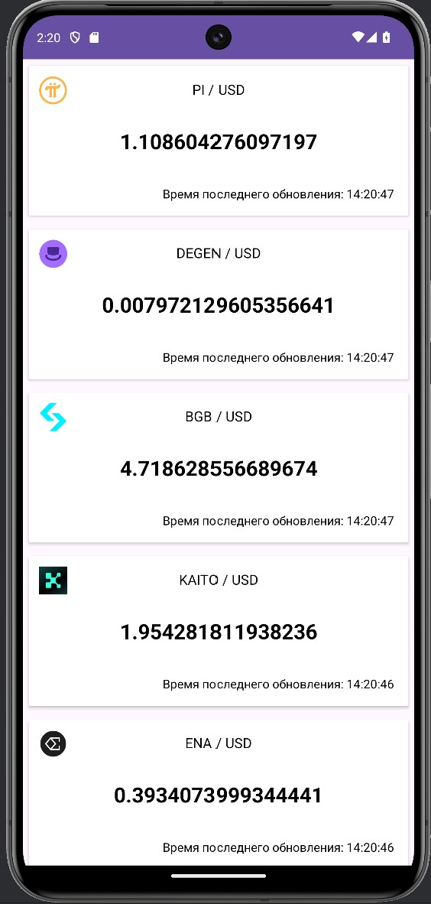
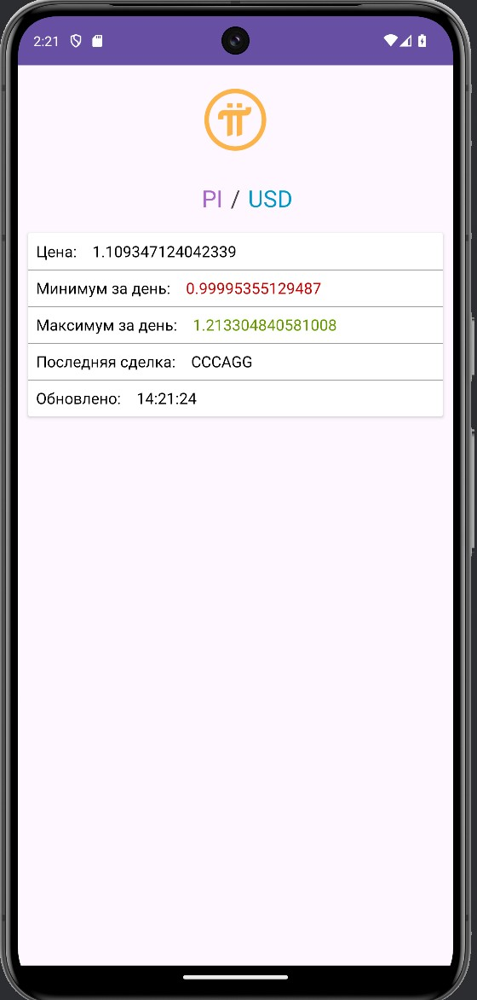
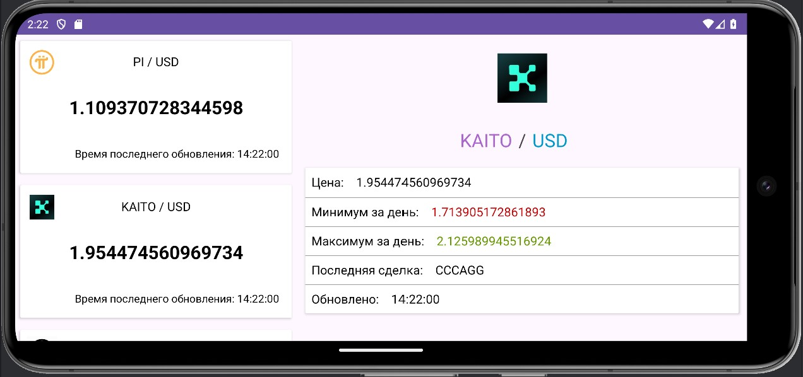

# Crypto Parser

## Overview
This is an Android mobile application written in Kotlin. It allows users to view information about the most popular cryptocurrencies in real time by trading volume.

## Features
- **autoupdate** - The app automatically updates data every 10 seconds, regardless of its status, thanks to a background service.
- **cache** - Saving information to a local database so that the application is available offline.

## Tech Stack
| **Category**             | **Technologies**                  |
|--------------------------|-----------------------------------|
| **Language**             | Kotlin                            |
| **Architecture**         | Clean Architecture                |
| **Reactive Programming** | LiveData, Coroutines              |
| **Networking**          | Retrofit                          |
| **Database**            | Room                             |

## Screenshots

